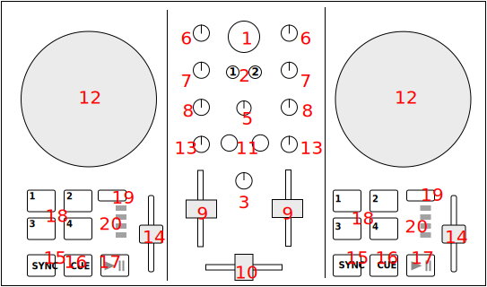

Numark Party Mix Live
================

`Manufacturer's product page Partymix II <https://www.numark.com/product/party-mix-ii>`_ · `Manufacturer's user manual <https://cdn.inmusicbrands.com/Numark/Party%20Mix%20MKII%20-%20User%20Guide%20-%20v1.4.pdf>`_ · `Forum thread <https://mixxx.discourse.group/t/numark-party-mix-ii-numark-party-mix-live-mapping/28861>`_

`Manufacturer's product page Partymix Live <https://www.numark.com/product/party-mix-live>`_ · `Manufacturer's user manual <https://www.numark.com/images/product_downloads/Party_Mix_Live_-_User_Guide_-_v1.3.pdf>`_ · `Forum thread <https://mixxx.discourse.group/t/numark-party-mix-ii-numark-party-mix-live-mapping/28861>`_

Based on https://github.com/mixxxdj/manual/blob/main/source/hardware/controllers/numark_party_mix.rsthttps://github.com/mixxxdj/manual/blob/main/source/hardware/controllers/numark_party_mix.rst

Overview
--------

See the tables below for controls descriptions.

Center
------

..

.. csv-table::
   :header: "#", "Name", "Function"
   :widths: 5 25 70

   "1", ":hwlabel:`BROWSE` (rotate)", "Browse library"
   "1", ":hwlabel:`BROWSE` (press+rotate)", "switch between Library and Sidebar"
   "1", ":hwlabel:`BROWSE` (press)", "Equivalent to double clicking the currently selected item in Library (see :mixxx:coref:`GoToItem<[Library],GoToItem>` control)"
   "2", ":hwlabel:`LOAD` 1 and 2", "load currently selected track to Deck 1 or 2"
   "3",  ":hwlabel:`MASTER GAIN`", "Adjust the volume level of :term:`master output`."
   "5",  ":hwlabel:`CUE GAIN`", "Adjust the headphone volume"
   "10", ":hwlabel:`Crossfader`", "Controls the mix between the two decks. See :ref:`interface-crossfader`"

Deck
----

Each of those controls exists in both :term:`decks<deck>` and affects only the corresponding deck.

.. csv-table::
   :header: "#", "Name", "Function"
   :widths: 5 25 70

   "6",  ":hwlabel:`GAIN`", "Adjust the pre-fader, pre-EQ audio level"
   "7",  ":hwlabel:`TREBLE`", "Adjust high frequencies"
   "8", ":hwlabel:`BASS`", "Adjust low frequencies"
   "9", ":hwlabel:`Channel fader`", "Adjust volume level"
   "11", ":hwlabel:`CUE`", ":term:`Headphone button`. Toggle sending channel to the cue (headphone) channel"
   "12", ":hwlabel:`Jog wheel`", "If scratch mode is enabled (see the :hwlabel:`SCRATCH` button below): scratch
   "13", ":hwlabel:`Filter`", ":term:`Filter`. Filter effect. Turn fully left for low-pass filter, fully right for high-pass filter, center position is no filter."

   The behavior of the jog wheel can be fine-tuned, see the :ref:`Adjustable values<numark_party_mix_adjustable>` section."

   "14", ":hwlabel:`Pitch fader`", "Adjust the speed of the track"
   "15", ":hwlabel:`SYNC`", "If sync lock is disabled: set BPM to the other deck's BPM

   If sync lock is enabled: disable sync lock"
   "15", ":hwlabel:`SYNC` (hold, then release)", "Enable :term:`sync lock`"
   "16", ":hwlabel:`CUE`", "If track is playing: stops the track and resets position to the main cue point

   If playback is stopped: sets the main cue point"
   "16", ":hwlabel:`CUE` (hold)", "Play the track from main cue point, release to stop playback and return to the main cue point. Playback must be initially stopped on the main cue point."
   "17", ":hwlabel:`Play/Pause`", "Play/pause playback"
   "18", ":hwlabel:`PADS 1-4`", "Pads 1-4 function depends on selected mode"
   "19", ":hwlabel:`PAD MODE`", "Select mode of :hwlabel:`PADS 1-4`"
   "20", ":hwlabel:`MODE LEDs`", "The 4 pads in each deck have multiple functions, depending on the selected *pad mode*. Default pad mode is *hotcues*. Current mode is selected by pressing :hwlabel:`PAD MODE`. The LED for currently active pad mode is lit up (or all 3 LEDs for effect mode)."

.. hint::
   The actual behavior of CUE and Play/Pause buttons depends on Mixxx settings. See :ref:`interface-cue-modes` for more info.

Pads
----

.. csv-table::
   :header: "#", "Name", "Function"
   :widths: 5 25 70

   "18", ":hwlabel:`CUE Mode`", "set hotcue if not set. If set, go to hotcue position and start playback.

   Pad lights indicate if a particular hotcue is set or not."
   "18", ":hwlabel:`LOOP Mode`", "activate auto-loop.

   Default auto-loop sizes are: 4, 8, 16, 32. Loop sizes can be adjusted, see the :ref:`Adjustable values<numark_party_mix_adjustable>` section."
   "18", ":hwlabel:`SAMPLER Mode`", "button for 4 Samples for each Deck 1-4 and 5-8 (toggle play from start and stop)."
   "18", ":hwlabel:`EFFECT Mode`", "Pad 1-3 activates effect during press Deck1 of EffectUnit1, Deck2 of EffectUnit2.

   Pad 4 switches mix mode. Pad light on indicates Dry/Wet mode. Pad Light off indicates Dry+Wet mode."

Mapping details
---------------
This script is for the Numark Party Mix MK2 controller.
It is based on the work of several authors and has been modified
to suit the needs of the Rene Smit. (see below)

             |
             |
             V

Source .js and .xml file
https://github.com/magtomm/MIXXX-Numark-party-mix-2

             |
             |
             V

And these are based on 
based on https://github.com/rylito/mixxx_numark_partymix 
forked from https://github.com/jagy128/MIXXX-Numarl-party-mix-2

             |
             |
             V

Based on the script of Ryli Dunlap (rylito)
https://github.com/rylito/mixxx_numark_partymix

"Thanks to authors of other scripts used as a reference and to DJ Dexter 
and DarkPoubelle for the initial PartyMix mappings posted on the forum.""

//////////////////////////////////////////////////////////////////////

=== Knobs ===
Deck 1/2
Level → Treble
Treble → Mid
Filter → Quick effect super knob

=== PADS ===

HOT CUE
Deck 1 & 2
1-4 Set hotcue 1-4.
To delete the cue, use the screen (right click on the cue number, click the bin)

LOOP
Deck 1 & 2
1 Loop start
2 Loop end
3 Loop halve (only works when quantize is set ON)
4 Loop exit (deletes also the loop start)

Uses the quantize settings of the deck. (the magnet icon)
If the quantize is set to ON, the loop will be set to the nearest beat.
When pushing the “wrong” order, behavior might be unpredictable,
turn the loop of on the screen

SAMPLE 

the sampler mode is used as a second loopmode (1,2,4,8 beats)
to reverse:  change tha name of updateSamplerPadLEDs_ to updateSamplerPadLEDs and vica versa
             and adjust the (un)comments in PAD_MAPPINGS

Deck 1 & 2
1,2,4 and 8 beats. To unloop, press a second time. To delete the loop, go to loopmode and press 4.

original:
Deck 1
1-4 Sample 1-4

Deck 2
1-4 Sample 5-8

Samples are not automatically loaded (anymore) when the bank is empty
If you hit the pad when the sample is playing, the sample is not stopped
but restarted, so you can use the samples as drumcomputer

EFFECT
Deck 1
1 Toggle 1st Effect FX1
2 Toggle 2nd Effect FX1
3 Toggle 3rd Effect FX1
4 Vinyl stop efffect /
(commented out:Spin back)

Deck 2
1 Toggle 1st Effect FX2
2 Toggle 2nd Effect FX2
3 Toggle 3rd Effect FX2
4 Vinyl stop efffect /
(commented out:Spin back)

todo looptightening with the jogwheel https://www.youtube.com/watch?v=sa4hGzYdHwM 3:42

the sampler mode is used as a second loopmode (1,2,4,8 beats)
to reverse:  change tha name of updateSamplerPadLEDs_ to updateSamplerPadLEDs and vica versa
             and adjust the (un)comments in PAD_MAPPINGS
