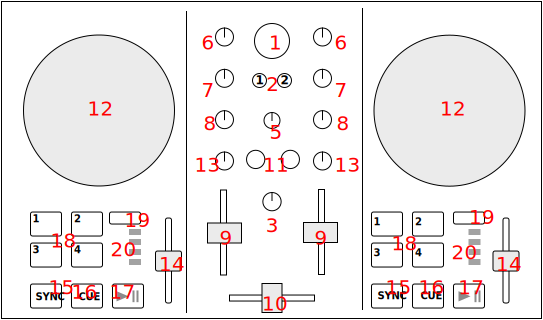

# Numark Party Mix Live

[Manufacturer's product page Partymix II](https://www.numark.com/product/party-mix-ii) · [Manufacturer's user manual](https://cdn.inmusicbrands.com/Numark/Party%20Mix%20MKII%20-%20User%20Guide%20-%20v1.4.pdf) · [Forum thread](https://mixxx.discourse.group/t/numark-party-mix-ii-numark-party-mix-live-mapping/28861)

[Manufacturer's product page Partymix Live](https://www.numark.com/product/party-mix-live) · [Manufacturer's user manual](https://www.numark.com/images/product_downloads/Party_Mix_Live_-_User_Guide_-_v1.3.pdf) · [Forum thread](https://mixxx.discourse.group/t/numark-party-mix-ii-numark-party-mix-live-mapping/28861)

Based on [mixxxdj manual file](https://github.com/mixxxdj/manual/blob/main/source/hardware/controllers/numark_party_mix.rst)

---

## Overview

See the tables below for controls descriptions.

---

## Center

| #  | Name                                   | Function                                                                                   |
|----|----------------------------------------|--------------------------------------------------------------------------------------------|
| 1  | **BROWSE** (rotate)                    | Browse library                                                                             |
| 1  | **BROWSE** (press+rotate)              | Switch between Library and Sidebar                                                         |
| 1  | **BROWSE** (press)                     | Equivalent to double clicking the currently selected item in Library                       |
| 2  | **LOAD** 1 and 2                       | Load currently selected track to Deck 1 or 2                                               |
| 3  | **MASTER GAIN**                        | Adjust the volume level of master output                                                   |
| 5  | **CUE GAIN**                           | Adjust the headphone volume                                                                |
| 10 | **Crossfader**                         | Controls the mix between the two decks. See interface-crossfader                           |

---

## Deck

Each of these controls exists in both decks and affects only the corresponding deck.

| #  | Name              | Function                                                                 |
|----|-------------------|--------------------------------------------------------------------------|
| 6  | **GAIN**          | Adjust the pre-fader, pre-EQ audio level                                |
| 7  | **TREBLE**        | Adjust high frequencies                                                 |
| 8  | **BASS**          | Adjust low frequencies                                                  |
| 9  | **Channel fader** | Adjust volume level                                                     |
| 11 | **CUE**           | Headphone button. Toggle sending channel to the cue (headphone) channel |
| 12 | **Jog wheel**     | Scratch when enabled with **SCRATCH** button                            |
| 13 | **Filter**        | Filter effect. Left = low-pass, Right = high-pass, Center = no filter   |
| 14 | **Pitch fader**   | Adjust the speed of the track                                           |
| 15 | **SYNC**          | Sync BPM or toggle sync lock                                            |
| 16 | **CUE**           | Cue point functions depending on state                                  |
| 17 | **Play/Pause**    | Play or pause playback                                                  |
| 18 | **PADS 1-4**      | Pads 1-4 function depends on selected mode                              |
| 19 | **PAD MODE**      | Select mode of pads                                                     |
| 20 | **MODE LEDs**     | Show active pad mode                                                    |

*The behavior of CUE and Play/Pause depends on Mixxx settings.*

---

## Pads

| #  | Name              | Function                                                                                     |
|----|-------------------|----------------------------------------------------------------------------------------------|
| 18 | **CUE Mode**      | Set hotcue if not set. If set, go to hotcue and start playback.                              |
| 18 | **LOOP Mode**     | Activate auto-loop (default sizes 4, 8, 16, 32).                                             |
| 18 | **SAMPLER Mode**  | Trigger 4 samples per deck (toggle play from start and stop).                                |
| 18 | **EFFECT Mode**   | Pads 1-3 activate effect during press. Pad 4 toggles mix mode (Dry/Wet vs Dry+Wet).          |

---

## Mapping details

This script is for the **Numark Party Mix MK2** controller.  
It is based on work of several authors and modified by **Rene Smit**.

Source files:  
<https://github.com/magtomm/MIXXX-Numark-party-mix-2>

Based on:  
- <https://github.com/rylito/mixxx_numark_partymix>  
- <https://github.com/jagy128/MIXXX-Numarl-party-mix-2>  

Original script by **Ryli Dunlap (rylito)**:  
<https://github.com/rylito/mixxx_numark_partymix>

Thanks also to DJ Dexter and DarkPoubelle for the initial PartyMix mappings.

---

## Knobs

**Deck 1/2**  
- Level → Treble  
- Treble → Mid  
- Filter → Quick effect super knob  

---

## Pads

### HOT CUE
- Pads 1-4: Set hotcue 1-4  
- To delete: use screen (right click on cue number, click bin)  

### LOOP
- Pad 1: Loop start  
- Pad 2: Loop end  
- Pad 3: Loop halve (only when quantize is ON)  
- Pad 4: Loop exit (also deletes loop start)  

Uses quantize settings of the deck (magnet icon).

### SAMPLE
Sampler mode acts as second loop mode (1, 2, 4, 8 beats).  
- Press again to unloop  
- To delete loop, switch to loop mode and press pad 4  

Original:  
- Deck 1 → Samples 1-4  
- Deck 2 → Samples 5-8  

Samples are not auto-loaded. Hitting a pad restarts the sample (use like a drum machine).  

### EFFECT
**Deck 1**  
- Pad 1: Toggle Effect 1 FX1  
- Pad 2: Toggle Effect 2 FX1  
- Pad 3: Toggle Effect 3 FX1  
- Pad 4: Vinyl stop effect (Spin back commented out)  

**Deck 2**  
- Pad 1: Toggle Effect 1 FX2  
- Pad 2: Toggle Effect 2 FX2  
- Pad 3: Toggle Effect 3 FX2  
- Pad 4: Vinyl stop effect (Spin back commented out)  

To-do: Loop tightening with jogwheel (see [video](https://www.youtube.com/watch?v=sa4hGzYdHwM&t=222s)).  
